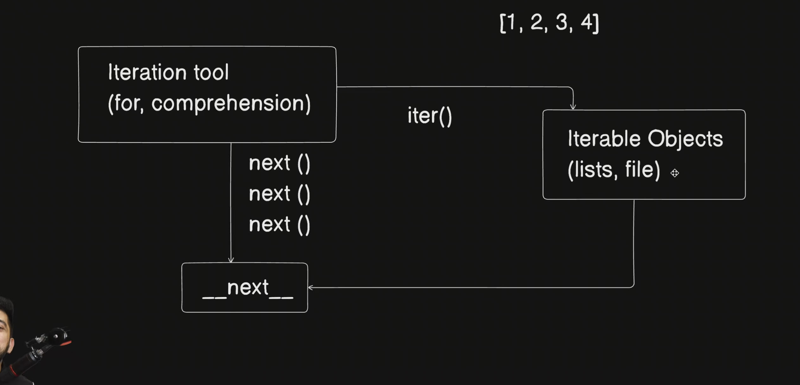
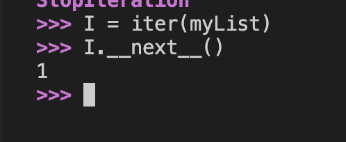

# Loops (Internal Working) !!!


- `__next__` generate hota haii ek dum bhdia sai jab tak next value exist kar rahi 
- aur isme kya hota ki list jab bhi milti toh uska first pointer milta hai uske bad saii usme next pointer sai next value milti rahtiii 

### To load the file and read it line by line 
```python
f = open('10.py')
###
f.readline() # This is used to read the line 
f.__next__() # This can also be used to get to the next line 
```
#### Output in the end 
- readline use `__next__` line internally 
- it is better to use readline cause well written 
   
  when the file end readline show
  
  but the `__next__` shows : 
  ```
  Traceback (most recent call last):
  File "<python-input-32>", line 1, in <module>
    f.__next__()
    ~~~~~~~~~~^^
    StopIteration
    ```
    - file will have it's has own it's own iter tool aur kisi pai nhi hota 
  #### Iter()
  - We need to this in the list or set but do not have to do this in file 
  - int file the file_name is itself it's iterator so no need of ite
 
 ###### Example of in List 
  


